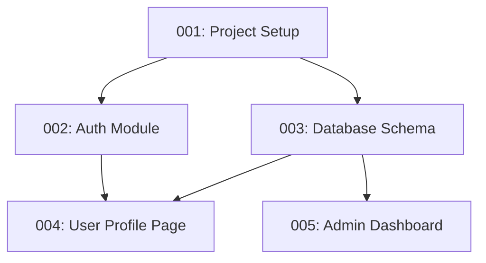

```markdown
# PhaseFlow: An AI-Driven Development Workflow

This is a structured, AI-driven workflow called **PhaseFlow** designed to manage a software project from start to finish. It's built around a few core principles:

1.  **Centralized Configuration:** All project-wide settings, like test commands and token limits, are stored in a single `phaseflow.config.yml` file for easy management.
2.  **Phase-Based Development:** Work is broken down into discrete, manageable `phases`. Each phase has a clear objective, success criteria, and is tracked in a central `_manifest.md`, which includes a visual dependency graph.
3.  **Rigorous Quality Assurance:** A dedicated `_testing/` directory makes test plans a mandatory part of every phase. A formal `/review` command ensures a human must approve complex work before it's completed.
4.  **Intelligent Automation:** The AI assistant operates using clear instructions from a `core_instructions.md` prompt and a suite of commands (like `/nextphase`, `/archive`) to manage the workflow, run tests, and update project status automatically.
5.  **Knowledge Retention:** A `_patterns/` library captures reusable solutions, while an `insights/` directory records key architectural decisions, creating a self-documenting project history. A lightweight `_tasks.md` file is included for small bugs and chores that don't need a full phase.

---

## File Structure

```
.
├── _manifest.md
├── _tasks.md
├── phaseflow.config.yml
└── _context/
    └── work/
        ├── .claude/
        │   └── commands/
        │       ├── archive.md
        │       ├── nextphase.md
        │       ├── phaseplan.md
        │       ├── phasestatus.md
        │       └── review.md
        ├── _archive/
        ├── _current/
        │   └── phase-template-checkpoint.md
        ├── _patterns/
        │   └── claude-patterns.md
        ├── _prompts/
        │   └── core_instructions.md
        ├── _testing/
        │   └── template-tests.md
        ├── insights/
        │   └── README.md
        └── phases/
            ├── phase-001.md
            └── template.md
```

---

## File Contents

### `phaseflow.config.yml`

```yaml
# phaseflow.config.yml
# Central configuration for the PhaseFlow system.

# -- Project Metadata --
project_name: "My Awesome App"
primary_language: "typescript"
frameworks: ["react", "nodejs", "express"]

# -- PhaseFlow Defaults --
# Default token limits for phases. Can be overridden in phase frontmatter.
token_limits:
  small: 20000
  medium: 40000
  large: 60000
  max: 80000 # AI should warn and suggest splitting a phase above this.

# Context management settings
context_alert_threshold: 0.70 # (70%) AI warns when context usage exceeds this.
max_active_phases: 3

# -- Testing Configuration --
# The command to run the entire test suite.
test_command: "npm test"

# The command to run tests for a specific file or pattern.
# Use {file_path} as a placeholder.
test_file_command: "npm test -- {file_path}"

# -- AI Behavior --
# Key prompt files the AI should always be aware of.
core_prompt_file: "_context/work/_prompts/core_instructions.md"
```

### `_manifest.md`

```md
# Work Manifest
Created: 2023-10-27T10:00:00Z
Last Updated: 2023-10-27T10:00:00Z

## Project Overview
[Describe your project's main goals and current state]

## Phase Dependency Graph
This graph is maintained by the AI and provides a visual overview of the workflow.



## Active Sessions
- Phase 001 is currently `active`.

## Phase Queue (Priority Order)
1.  **Phase 001: Project Setup** (Status: active, Est. Context: 20k tokens)
2.  **Phase 002: Auth Module** (Status: ready, Depends: 001, Est. Context: 35k tokens)
3.  **Phase 003: Database Schema** (Status: ready, Depends: 001, Est. Context: 25k tokens)
4.  **Phase 004: User Profile Page** (Status: planned, Depends: 002, 003)
5.  **Phase 005: Admin Dashboard** (Status: concept, Depends: 003)

## Quick References
- **Config:** `phaseflow.config.yml`
- **Phase Template:** `_context/work/phases/template.md`
- **Test Template:** `_context/work/_testing/template-tests.md`
- **Core Instructions:** `_context/work/_prompts/core_instructions.md`
```

### `_tasks.md`

```md
# Quick Tasks & Bug Fixes

This file tracks small, actionable items that do not require a full PhaseFlow phase.
Use the format: `- [ ] #{ID} [TYPE]: Brief description. (Priority: Low/Med/High)`

## To Do
- [ ] #101 [BUG]: Login button is misaligned on mobile Safari. (Priority: High)
- [ ] #102 [REFACTOR]: Consolidate duplicate `getUser` functions in `api.js`. (Priority: Med)
- [ ] #103 [DOCS]: Update README with new environment variable. (Priority: Low)

## In Progress
- [ ] #100 [BUG]: User logout does not clear session cookie properly. (Assigned: Claude)

## Done
- [x] #99 [CHORE]: Upgrade `express` dependency to latest patch version.
```

### `_context/work/.claude/commands/archive.md`

```md
# Archive Command

When /archive {number} is used:

1. Verify the phase status is `done` in `_manifest.md`.
2. Move the completed phase file from `_context/work/phases/` to `_context/work/_archive/`.
3. Move any related checkpoint files from `_context/work/_current/` to `_context/work/_archive/`.
4. Move the corresponding test plan from `_context/work/_testing/` to `_context/work/_archive/`.
5. Update `_manifest.md` to remove the phase from the queue and update the dependency graph.
6. Extract final successful patterns to `_context/work/_patterns/claude-patterns.md`.
7. Announce: "Phase XXX archived successfully. Ready for next phase."
```

### `_context/work/.claude/commands/nextphase.md`

```md
# Next Phase Command

When /nextphase is used:

1. Read `phaseflow.config.yml` for system settings.
2. Read `_manifest.md` to identify the highest priority `ready` phase.
3. Load the phase definition from `_context/work/phases/phase-XXX.md`.
4. Check that all its dependencies are `done`.
5. Load the corresponding test plan from `_context/work/_testing/phase-XXX-tests.md`.
6. Estimate context usage and warn if it exceeds the `context_alert_threshold`.
7. Present a summary and ask for confirmation:
"Ready to start Phase XXX: [name].
Objective: [objective]
Dependencies satisfied: ✓
Should I proceed with [first step]?"
```

### `_context/work/.claude/commands/phaseplan.md`

```md
# Phase Plan Command

When /phaseplan {number} is used:

1. Load `_context/work/phases/phase-{number}.md`.
2. Load any checkpoint files: `_context/work/_current/phase-{number}-checkpoint.md`.
3. Load the test plan: `_context/work/_testing/phase-{number}-tests.md`.
4. Present the full phase plan, including:
   - Objective and success criteria
   - Implementation steps
   - Current progress (if any)
   - The full test plan
```

### `_context/work/.claude/commands/phasestatus.md`

```md
# Phase Status Command

When /phasestatus is used:

1. Scan `_manifest.md` for all `active` or `blocked` phases.
2. For each active phase, review its checkpoint file in `_context/work/_current/`.
3. Report progress against success criteria and the test plan.
4. Format as a clear status dashboard:
```
📊 Phase Status Dashboard
━━━━━━━━━━━━━━━━━━━━━━━
Phase XXX: [Name]
Progress: ███████░░░ 70%
Status: [On track / Blocked / Review Required]
Blocker: [Reason if blocked]

Recommended Action: [Next logical step]
```
```

### `_context/work/.claude/commands/review.md`

```md
# Review Command

When /review {number} is used:

1.  Load the specified phase from `_context/work/phases/phase-{number}.md`.
2.  Verify its status is `review_required`.
3.  Load the corresponding test plan from `_context/work/_testing/phase-{number}-tests.md` and check its status.
4.  Summarize the work done, linking to file changes (diffs if possible).
5.  Present the summary and test results to the user.
6.  Ask for a decision: "Does this work meet all success criteria? (approve/reject/comment)"

-   **If approved:** Change the phase status to `done`. Announce that it's ready for archival.
-   **If rejected:** Change the phase status to `blocked`. Ask for specific feedback on what needs to be fixed and record it in the checkpoint file.
```

### `_context/work/_current/phase-template-checkpoint.md`

```md
# Phase XXX Checkpoint
Last Updated: [timestamp]

## Current State
- ✅ [Completed items from implementation plan]
- 🔄 [In progress items with percentage]
- ⏳ [Pending items]

## Blocker
[Describe any current blockers or issues discovered]

## Next Steps
1. [Immediate next action]
2. [Following action]

## Session Notes
- Key decisions made this session.
- Files modified this session.
- Context usage: X%
```

### `_context/work/_patterns/claude-patterns.md`

```md
# Project-Specific Patterns & Solutions

This file contains battle-tested patterns discovered during development. Consult this file before starting new work.

---
## Pattern Template
When adding new patterns, use this format:

### Pattern: [Descriptive Name]
- **Phase:** XXX
- **Category:** [architecture|security|performance|testing|refactor]
- **Problem:** What specific problem does this solve?
- **Solution:** How to implement it (key decisions and approach).
- **Code Example:**
```language
// Actual code that works
```
- **Gotchas:** What to watch out for.

---
*Existing patterns will be added below this line.*
```

### `_context/work/_prompts/core_instructions.md`

```md
# Core Instructions for PhaseFlow AI Assistant

You are an expert AI software engineer operating within the "PhaseFlow" methodology. Your primary goal is to execute development tasks systematically, manage context efficiently, and learn from your work.

## 1. Core Directives
- **Consult Configuration:** Always start by reading `phaseflow.config.yml` to understand project standards (test commands, token limits, etc.).
- **Follow the Manifest:** The `_manifest.md` is your source of truth for phase priority and dependencies.
- **One Phase at a Time:** Only work on one `active` phase at a time unless explicitly told otherwise.
- **Test Rigorously:** Use the commands from `phaseflow.config.yml` to run tests. Refer to the corresponding file in `_testing/` for the test plan. Work is not complete until all tests pass.
- **Request Review:** For complex phases, set the status to `review_required` when you believe the work is done. Do not proceed until you receive human approval via the `/review` command.

## 2. Knowledge Management (Pattern & Memory System)

### When to SAVE a Pattern:
You must save knowledge to `_patterns/claude-patterns.md` when you:
1.  Successfully solve a non-trivial technical problem.
2.  Complete a phase and identify a reusable architecture or code snippet.
3.  Discover a critical "gotcha" or workaround specific to this project's tech stack.

### Pattern SAVE Format:
Use this template in `_patterns/claude-patterns.md`:

    ### Pattern: [Descriptive Name]
    - **Phase:** XXX
    - **Category:** [architecture|security|performance|testing|refactor]
    - **Problem:** What specific problem does this solve?
    - **Solution:** How to implement it (key decisions and approach).
    - **Gotchas:** What to watch out for.

### When to RECALL a Pattern:
You must search your knowledge base before starting new work. Recall patterns when:
1.  Starting a new phase (check for patterns from dependent phases).
2.  Encountering keywords from your pattern categories (e.g., 'auth', 'database', 'performance').
3.  The task description closely matches a problem you've solved before.

## 3. Command Execution
- `/nextphase`: Find the highest-priority `ready` phase in the manifest, present your plan, and ask for confirmation.
- `/phasestatus`: Provide a dashboard of active phases, their progress, and any blockers.
- `/review`: Summarize completed work and test results, then await human approval.
- `/archive`: Move a `done` phase and its test file to the `_archive/` directory, update the manifest, and save final patterns.
```

### `_context/work/_testing/template-tests.md`

```md
---
phase: XXX # Corresponds to the phase number
status: pending # pending -> running -> pass / fail
last_run: null
---

# Test Plan for Phase XXX: [Phase Name]

## Objective
Verify that all success criteria for Phase XXX have been met and no regressions were introduced.

## Test Cases

### 1. [Test Case: Unit Test for New Function]
- **File(s):** `src/utils/new-feature.ts`
- **Description:** Ensure the `calculate_score` function returns correct values for edge cases.
- **Inputs:** `(10, 0)`, `(-5, 5)`, `(null)`
- **Expected Outputs:** `0`, `0`, `Error`
- **Status:** ⬜ Pending

### 2. [Test Case: Integration Test for API Endpoint]
- **File(s):** `src/api/routes.ts`, `tests/integration/api.test.ts`
- **Description:** Verify the `POST /api/users` endpoint correctly creates a user and returns a 201 status.
- **Inputs:** `POST` request with valid user payload.
- **Expected Outputs:** `HTTP 201 Created`, response body contains user ID.
- **Status:** ⬜ Pending

### 3. [Test Case: Regression Test]
- **File(s):** `src/auth/login.ts`
- **Description:** Ensure that changes in this phase did not break the existing login flow.
- **Inputs:** Run existing authentication test suite.
- **Expected Outputs:** All existing auth tests must pass.
- **Status:** ⬜ Pending

---

## Test Run Log
- **[Timestamp]:** Test run initiated.
```

### `_context/work/insights/README.md`

```md
# Insights Directory

This directory contains standalone insights discovered during development that don't belong to specific phases. These are the "why" behind our decisions.

## File Naming Convention
- `insight-{topic}-{date}.md` for general insights
- `decision-{topic}.md` for important architectural decisions

## Content Guidelines
Each insight should include:
- Problem or opportunity identified
- Solution or approach taken
- Results and lessons learned
- Applicability to future work
```

### `_context/work/phases/phase-001.md`

```md
---
phase: 001
slug: project-setup
status: ready # Status can be: proposed, ready, active, blocked, review_required, done
created: $(date -u +"%Y-%m-%dT%H:%M:%SZ")
depends_on: null
enables: ["002", "003"]
claude_context:
  token_size: small # Uses config: 20000
  requires_files: 
    - "package.json"
    - "README.md"
tags: ["setup", "configuration"]
---

# Phase 001: Project Setup and Configuration

## Objective
Establish the foundational project structure, dependencies, and development environment configuration as defined in `phaseflow.config.yml`.

## Success Criteria
- [ ] `package.json` is configured with all necessary dependencies.
- [ ] Development environment variables are documented in `README.md`.
- [ ] Basic project structure created (`src/`, `tests/`).
- [ ] Linting and formatting tools (ESLint/Prettier) are configured.
- [ ] A test plan exists at `_context/work/_testing/phase-001-tests.md`.

## Implementation Plan
1.  **Analyze Current State:** Review existing project files against `phaseflow.config.yml`.
2.  **Set Up Dependencies:** Add necessary npm packages and configure build/test scripts.
3.  **Establish Code Quality Tools:** Configure ESLint/Prettier and add pre-commit hooks.
4.  **Create Test Plan:** Generate the test plan for this phase to verify setup.

## Expected Outputs
- Updated `package.json`
- New configuration files (`.eslintrc`, `.prettierrc`, etc.)
- Updated `README.md` with setup instructions.
- A new `_context/work/_testing/phase-001-tests.md` file.
```

### `_context/work/phases/template.md`

```md
---
phase: XXX
slug: phase-name
status: proposed # Status can be: proposed, ready, active, blocked, review_required, done
created: $(date -u +"%Y-%m-%dT%H:%M:%SZ")
depends_on: null # e.g., ["001", "002"]
enables: [] # e.g., ["004"]
claude_context:
  token_size: medium # small | medium | large | max_tokens: XXXXX
  requires_files: [] # e.g., ["src/auth/*", "package.json"]
tags: []
---

# Phase XXX: [Phase Name]

## Objective
[Clear, measurable goal for this phase]

## Success Criteria
- [ ] Criterion 1 (measurable and verifiable)
- [ ] Criterion 2 (measurable and verifiable)
- [ ] A test plan for this phase exists at `_context/work/_testing/phase-XXX-tests.md`

## Implementation Plan
### Step 1: [First Major Step]
[Detailed description of what needs to happen]

### Step 2: [Second Major Step]
[Continue breaking down the work]

## Risk Factors
- [Potential complexities or dependencies]

## Expected Outputs
- [List of new/modified files]
- [Any new patterns to be saved]
```
```